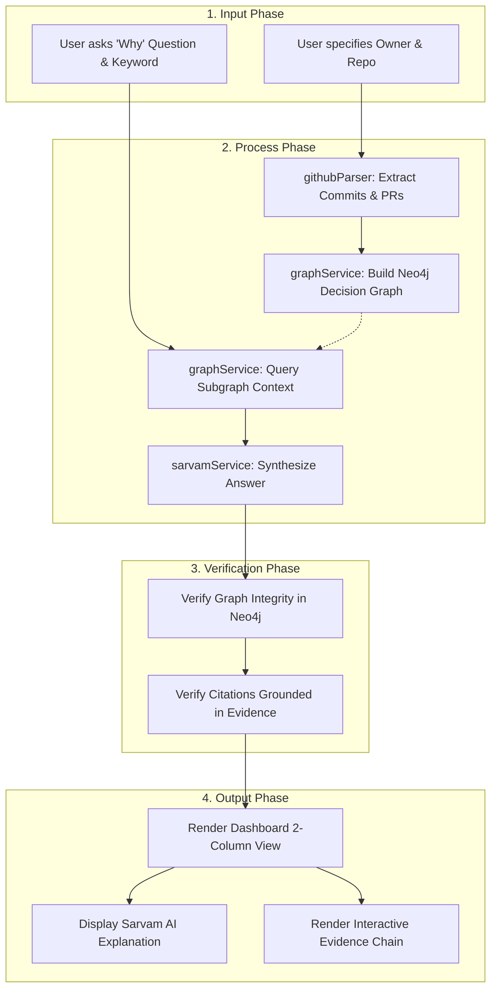

# Reusable System Workflow: Why The Code Is Like This

This document outlines the standard operational workflow of the "Why The Code Is Like This" platform, structured into four core phases: **Input**, **Process**, **Verification**, and **Output**.

---

## 1. Input Phase
- **Repository Ingestion Inputs**:
  - `owner`: GitHub account or organization name (e.g., `expressjs`).
  - `repo`: Target repository name (e.g., `express`).
- **GraphRAG Query Inputs**:
  - `question`: Natural language question inquiring about developer intent (e.g., `"Why was error handling modified in router.js?"`).
  - `keyword`: Target code entity or keyword (e.g., `router.js`).

---

## 2. Process Phase
1. **GitHub Data Extraction (`backend/services/githubParser.js`)**:
   - Fetches the last 30 commits, detailed file diffs (`additions`/`deletions`), closed PRs, and review discussions via Octokit REST API.
2. **Decision Graph Construction (`backend/services/graphService.js`)**:
   - Clears existing graph session (`DETACH DELETE`).
   - Writes `:Repository`, `:CodeEntity`, `:Commit`, `:PullRequest`, and `:Discussion` nodes into Neo4j.
   - Links relationships (`CONTAINS`, `MODIFIED_IN`, `BELONGS_TO`, `DISCUSSES`).
3. **Subgraph Evidence Retrieval**:
   - Executes Cypher `UNION` query on `:CodeEntity` filenames and `:Commit` messages matching `keyword`.
   - Returns connected commit metadata, PR descriptions, and discussion comments.
4. **LLM Evidence Synthesis (`backend/services/sarvamService.js`)**:
   - Sends graph context JSON and developer question to Sarvam AI (`sarvam-2b`).
   - Enforces Markdown formatting with mandatory citations.

---

## 3. Verification Phase
- **Health Check Verification**: `GET /api/health` ensures Express backend service is running.
- **Graph Database Verification**: `verifyConnection()` checks Neo4j AuraDB connectivity on startup.
- **Evidence Integrity Verification**: Ensures every claim in the generated answer directly cites a valid SHA, PR number, or discussion quote returned in the Neo4j context.

---

## 4. Output Phase
- **Response Payloads**:
  - `POST /api/ingest` -> `{ status: "success", graphStatus: "built", data: repoData }`
  - `POST /api/query` -> `{ status: "success", answer: "...", evidence: [...] }`
- **Dashboard Visualization**:
  - **Left Panel**: Formatted Markdown answer with headings, rationale, and citations.
  - **Right Panel**: Interactive cards rendering the exact Neo4j evidence chain (Code Entity badge, Commit SHA, Author, Date, PR number, and Review discussion quotes).
